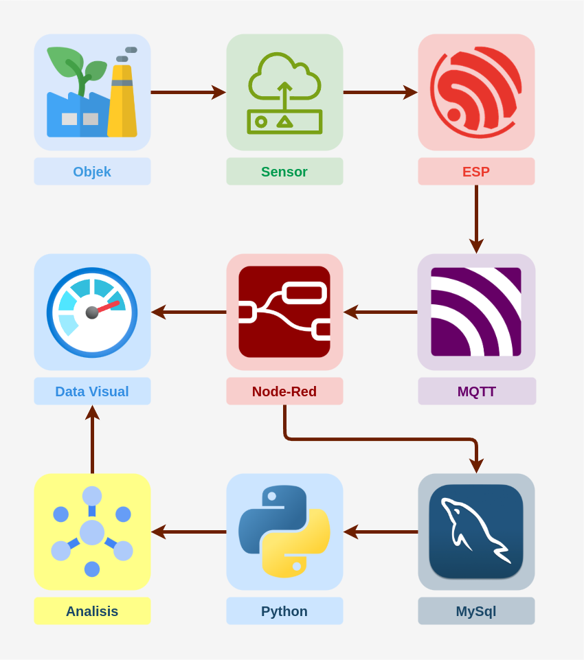
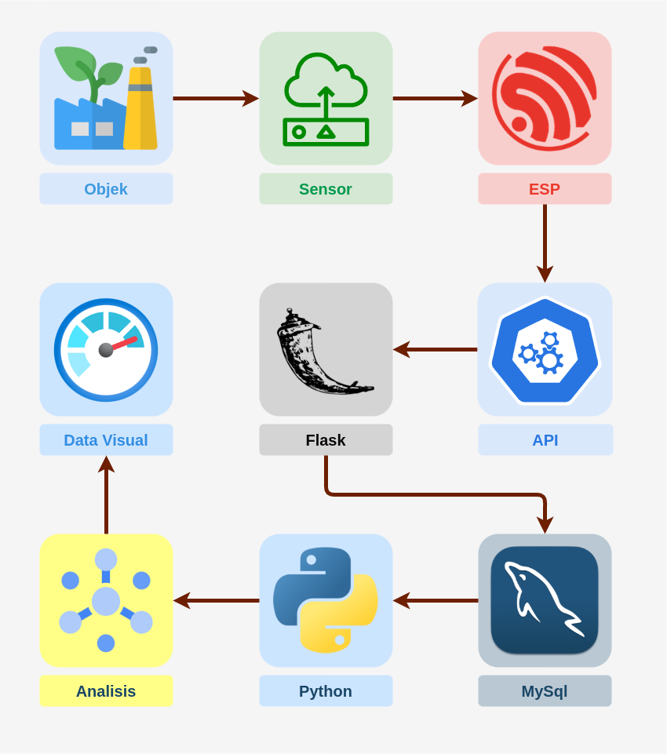

# Sistem Komunikasi Data

## MQTT



    ESP mengambil data dari Objek yang di pantau dengan menggunakan sensor tertentu dan di kirim ke MQTT.

    Node-Red membaca pesan dari MQTT, pesan tersebut di konversi ke dalam bentuk objek data yang di visualkan dan di kirim ke MySQL.

    Python mengambil data dari MySql dan melakukan Analisis dimana hasilnya akan di visualkan.

## API



    ESP mengambil data dari Objek yang di pantau dengan menggunakan sensor tertentu dan di kirim ke API.

    Flask membaca pesan dari API, pesan tersebut di konversi ke dalam bentuk objek data yang di kirim ke MySQL.

    Python mengambil data dari MySql dan melakukan Analisis dimana hasilnya akan di visualkan.

# Data

## Basic

| Index | Name              | Type     | Length | Example                | Satuan                   |
| ----- | ----------------- | -------- | ------ | ---------------------- | ------------------------ |
| 0     | id                | INT      | 11     | 1                      | -                        |
| 1     | id_device         | VARCHAR  | 20     | "ESP32-01"             | -                        |
| 2     | kelembapan_udara  | FLOAT    |        | 75.5                   | %                        |
| 3     | suhu_udara        | FLOAT    |        | 30.5                   | °C                      |
| 4     | kelembapan_tanah  | INT      |        | 45                     | %                        |
| 5     | nutrisi_tanah     | INT      |        | 1200                   | ppm                      |
| 6     | kondisi_daya      | INT      |        | 85                     | %                        |
| 7     | curah_hujan       | INT      |        | 12                     | mm                       |
| 8     | intensitas_cahaya | FLOAT    |        | 450.75                 | lux                      |
| 9     | lokasi            | VARCHAR  | 50     | "-6.200000,106.816666" | ° (latitude, longitude) |
| 10    | address_device    | VARCHAR  | 20     | {id custom point}      | -                        |
| 11    | timestamp         | DATETIME |        | "2025-03-07 14:30:00"  | -                        |

Penjelasan tambahan:

- **`kelembapan_udara` & `kelembapan_tanah`**: Satuan dalam persen (%).
- **`suhu_udara`**: Satuan derajat Celsius (°C).
- **`nutrisi_tanah`**: Satuan ppm (parts per million).
- **`kondisi_daya`**: Representasi daya dalam persen (%), misalnya kapasitas baterai.
- **`curah_hujan`**: Satuan dalam milimeter (mm).
- **`intensitas_cahaya`**: Satuan dalam lux.
- **`lokasi`**: Berisi koordinat geografis dalam derajat.

## Filters

### Setup

| Index | Name           | Type     | Length | Example                | Satuan                   |
| ----- | -------------- | -------- | ------ | ---------------------- | ------------------------ |
| 1     | id_device      | VARCHAR  | 20     | "ESP32-01"             | -                        |
| 9     | location       | VARCHAR  | 50     | "-6.200000,106.816666" | ° (latitude, longitude) |
| 10    | address_device | VARCHAR  | 20     | {id custom point}      | -                        |
| 11    | timestamp      | DATETIME |        | "2025-03-07 14:30:00"  | -                        |

### Loop

| Index | Name              | Type     | Length | Example               | Satuan |
| ----- | ----------------- | -------- | ------ | --------------------- | ------ |
| 1     | id_device         | VARCHAR  | 20     | "ESP32-01"            | -      |
| 2     | kelembapan_udara  | FLOAT    |        | 75.5                  | %      |
| 3     | suhu_udara        | FLOAT    |        | 30.5                  | °C    |
| 4     | kelembapan_tanah  | INT      |        | 45                    | %      |
| 5     | nutrisi_tanah     | INT      |        | 1200                  | ppm    |
| 6     | kondisi_daya      | INT      |        | 85                    | %      |
| 7     | curah_hujan       | INT      |        | 12                    | mm     |
| 8     | intensitas_cahaya | FLOAT    |        | 450.75                | lux    |
| 11    | timestamp         | DATETIME |        | "2025-03-07 14:30:00" | -      |

# Sistem Komunikasi Jaringan

## GSM

## ACCESS POIT

## ESP MESH

# Low Latensi

#### **Light Sleep** (WiFi tetap tersambung, lebih cepat bangun)

* ESP32 tidur dalam mode hemat daya  **tanpa mematikan WiFi & koneksi MQTT** .
* **Cocok untuk jeda pengiriman data ≤ 30 detik** .
* **Kelebihan** : Bangun cepat (~1-5ms) dan tetap tersambung ke WiFi.
* **Kekurangan** : Konsumsi daya lebih tinggi dibanding Deep Sleep.

**Cara Pakai:**

```cpp
enterSleepMode(false, 5); // Light Sleep selama 5 detik
```

---

#### **Deep Sleep** (WiFi mati, paling hemat daya)

* ESP32 benar-benar mati kecuali RTC, dan harus  **reconnect WiFi setelah bangun** .
* **Cocok untuk jeda pengiriman data ≥ 30 detik** .
* **Kelebihan** : Paling hemat daya (hanya 0.01-2mA saat tidur).
* **Kekurangan** : Perlu waktu lebih lama (~1-2 detik) untuk reconnect WiFi.

**Cara Pakai:**

```cpp
enterSleepMode(true, 30); // Deep Sleep selama 30 detik
```

| **Fitur**             | **vTaskDelay()**                           | **Light Sleep**                                                        | **Deep Sleep**                                      |
| --------------------------- | ------------------------------------------------ | ---------------------------------------------------------------------------- | --------------------------------------------------------- |
| **Skema**             | Menunggu tanpa tidur (hanya delay di FreeRTOS)   | ESP32 tidur ringan, tapi bisa dibangunkan oleh WiFi, Timer, atau Interrupt   | ESP32 mati total kecuali RTC, bangun ulang seperti reboot |
| **Proses**            | Tetap aktif, hanya menunggu dalam loop FreeRTOS  | CPU mati sementara, RAM tetap hidup, WiFi tetap tersambung (jika diaktifkan) | CPU dan RAM mati, hanya RTC hidup untuk bangun            |
| **Waktu Bangun**      | Tidak ada (karena tidak tidur)                   | Sangat cepat (~1-5ms)                                                        | Lambat (~100-2000ms karena harus reconnect WiFi & MQTT)   |
| **Konsumsi Daya**     | **Tertinggi**(~80-150mA, tergantung WiFi)  | **Sedang**(~0.8-5mA, tergantung WiFi)                                  | **Terendah**(~0.01-2mA saat tidur)                  |
| **Koneksi WiFi**      | Selalu tersambung                                | Bisa tetap tersambung jika `WIFI_MODEM_SLEEP`digunakan                     | Harus reconnect setiap bangun                             |
| **Ketahanan Baterai** | **Boros daya**                             | **Hemat daya**                                                         | **Sangat hemat daya**                               |
| **Cocok Untuk**       | Aplikasi real-time yang membutuhkan respon cepat | Jeda pengiriman data**≤ 30 detik**                                          | Jeda pengiriman data**≥ 30 detik**                       |
| **Contoh Penggunaan** | `vTaskDelay(5000 / portTICK_PERIOD_MS);`       | `esp_light_sleep_start();`                                                 | `esp_deep_sleep_start();`                               |
